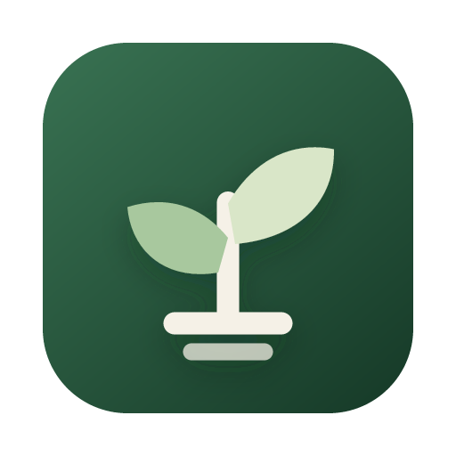
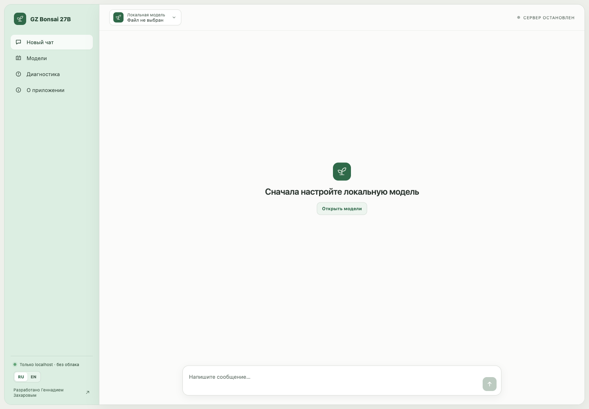
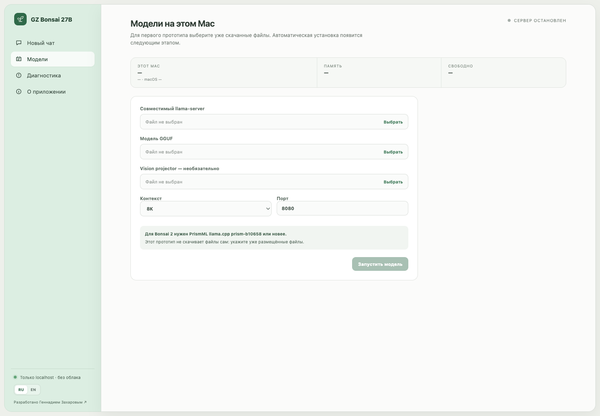

<p align="center"></p>
<h1 align="center">GZ Bonsai 27B</h1>
<p align="center">Простое открытое macOS-приложение для приватного запуска моделей Bonsai на своём Mac.</p>
<p align="center">
  <a href="https://github.com/globa-me/gz-bonsai-27b/actions/workflows/ci.yml"></a>
  
  
</p>



## Скачать

[Скачать GZ Bonsai 27B 0.1.0 для Apple Silicon](https://github.com/globa-me/gz-bonsai-27b/releases/download/v0.1.0/GZ-Bonsai-27B-0.1.0-arm64.dmg) — подписанный и нотариально заверенный Apple DMG. Перетащите приложение в папку Applications.

Версия `0.1.0` — предварительный выпуск: чат уже работает с вручную выбранными runtime и GGUF, а встроенная загрузка моделей появится позже.

## Зачем нужен проект

Официальные модели PrismML можно запускать локально, но новичку приходится разбираться в GGUF, совместимых сборках llama.cpp, портах, контексте и командах Terminal. GZ Bonsai 27B превращает это в обычное настольное приложение: выбрать модель, запустить её и начать чат.

Основные принципы:

- данные и сообщения остаются на компьютере;
- сервер слушает только `127.0.0.1`;
- русский интерфейс включён по умолчанию, английский доступен переключателем;
- рекомендации по памяти не выдаются за гарантии без реальных измерений;
- диагностику можно скопировать одной кнопкой без сообщений, секретов и полных путей;
- обновления устанавливаются вручную из GitHub Releases — встроенного автообновления нет.

## Что уже работает

Текущий `0.1.0` — проверяемый вертикальный прототип для macOS на Apple Silicon:

- Tauri 2 + React + TypeScript;
- нативное определение чипа, архитектуры, RAM, версии macOS и свободного места;
- ручной выбор совместимого `llama-server`, GGUF-модели и необязательного `mmproj`;
- запуск процесса только на localhost, проверка занятого порта и health check;
- потоковый ответ через `/v1/chat/completions`;
- корректная остановка процесса и остановка при закрытии приложения;
- RU/EN-локализация;
- безопасный копируемый диагностический отчёт;
- подписанная сборка Developer ID и DMG с перетаскиванием в Applications.



## Что ещё не готово

- автоматическая установка проверенного PrismML runtime;
- каталог и скачивание Bonsai 1.7B, 4B, 8B и 27B с паузой, возобновлением и SHA-256;
- рекомендация модели и контекста после измерений на реальных Mac;
- история и переименование чатов;
- загрузка изображений;
- MCP-инструменты и включаемый веб-поиск;
- интеграции OpenCode и Tailscale;
- публичный стабильный релиз после завершения встроенной загрузки моделей.

## Почему нужен PrismML llama.cpp

Ternary Bonsai 2 27B использует форматы `PTQ1_0` и `PQ2_0`, которым требуется форк `PrismML-Eng/llama.cpp` версии `prism-b10658` или новее. Обычная сборка upstream llama.cpp для Bonsai 2 не считается совместимой.

Актуальные проверенные имена файлов, размеры, SHA-256 и лицензии записаны в [docs/verified-artifacts.md](docs/verified-artifacts.md).

## Запуск прототипа

Требования: macOS 13+, Apple Silicon, Node.js, Rust stable и Xcode Command Line Tools.

```bash
npm install
npm run tauri -- dev
```

В приложении откройте «Модели» и укажите совместимый `llama-server`, GGUF-файл, необязательный `mmproj` и безопасный размер контекста. После health check откроется локальный чат. Полные инструкции: [docs/development.md](docs/development.md).

## Проверка

```bash
npm test
npm run build
cargo test --manifest-path src-tauri/Cargo.toml
```

Тесты проверяют синхронность RU/EN-каталогов, обязательный bind к loopback, аргументы vision projector и разбор OpenAI SSE-потока.

Дополнительно выполнен реальный smoke-тест на Apple M3 Pro: официальный runtime `prism-b10709-9a9394a` загрузил Bonsai 1.7B Q1_0, прошёл health check и вернул потоковый ответ. Условия и границы проверки: [docs/smoke-test-2026-09-21.md](docs/smoke-test-2026-09-21.md).

## Сборка подписанного DMG

```bash
npm run tauri -- build --bundles dmg
```

В `src-tauri/tauri.conf.json` закреплена подпись `Developer ID Application: Gennadiy Zakharov (BN3D9H4C7J)`. Публичный DMG подписан, нотариально заверен Apple и проверен Gatekeeper. На чужой машине значение нужно заменить либо убрать для неподписанной локальной сборки. Секреты нотариального сервиса не хранятся в репозитории.

## Архитектура и безопасность

- React отвечает за интерфейс и локализацию.
- Rust проверяет файлы, управляет `llama-server`, выполняет health check и проксирует streaming API через Tauri events.
- Полные пути удаляются из диагностического отчёта.
- Веса `*.gguf`, временные загрузки и build-артефакты исключены из Git.
- Сетевой адрес жёстко ограничен `127.0.0.1`.

Подробности: [docs/architecture.md](docs/architecture.md).

## Лицензии

Код приложения распространяется по лицензии [MIT](LICENSE). PrismML Bonsai weights — Apache 2.0, PrismML llama.cpp fork — MIT. Веса моделей не входят в репозиторий и DMG.

## Автор

Разработано [Геннадием Захаровым](https://zakharov.asia/).

Проект не является официальным приложением PrismML. Названия моделей и сторонние товарные знаки принадлежат их владельцам.
