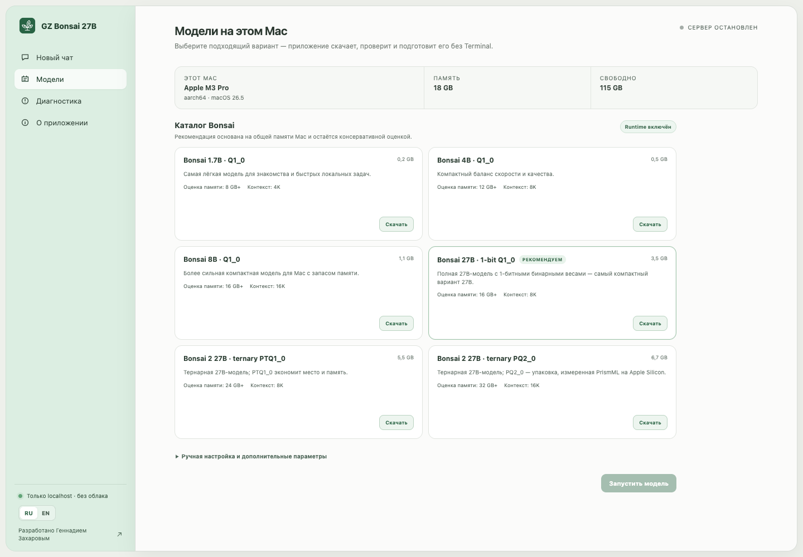

<p align="center"></p>
<h1 align="center">GZ Bonsai 27B</h1>
<p align="center">Простое открытое macOS-приложение для приватного запуска моделей Bonsai на своём Mac.</p>
<p align="center">
  <a href="https://github.com/globa-me/gz-bonsai-27b/releases/tag/v0.6.3"></a>
  
  
</p>


## Скачать

[Скачать GZ Bonsai 27B 0.6.3 для Apple Silicon](https://github.com/globa-me/gz-bonsai-27b/releases/download/v0.6.3/GZ-Bonsai-27B-0.6.3-arm64.dmg) — подписанный и нотариально заверенный DMG. Перетащите приложение в папку Applications и работайте на здоровье :-).

Совместимый runtime уже находится внутри приложения. Откройте «Модели», скачайте выбранный вариант и запустите локальный чат.

### Что нового в 0.6.3

В каталоге и меню выбора модели под названием Bonsai компактно показана исходная Qwen. Рядом находятся отдельные ссылки на карточки Bonsai и Qwen в Hugging Face. Для 27B учтены разные основы: Qwen3.6 у Bonsai 27B и Qwen3.8 у Bonsai 2. Подробнее: [заметки к 0.6.3](docs/release-notes-0.6.3.md) и [проверка](docs/e2e-0.6.3.md).

### Что нового в 0.6.2

В чате кнопки вложений, документов и веб-поиска стали компактными и освободили место для текста. Боковую панель можно свернуть и открыть снова; «Другие модели» заметнее в каталоге. Строка о внешнем поиске теперь помещается под полем ввода, а повторные пояснения убраны. Для Bonsai 2 веб-поиск выключает thinking, чтобы черновик рассуждений не попадал в ответ, и использует параметры instruct-режима, рекомендованные PrismML. Подробнее: [заметки к 0.6.2](docs/release-notes-0.6.2.md) и [проверка](docs/e2e-0.6.2.md).

### Что нового в 0.6.1

Селектор модели вверху чата показывает установленные модели. Выбор запускает модель; если другая уже работает, приложение сначала останавливает её. В этом же меню можно остановить модель или открыть каталог загрузок. Во время генерации и переключения действия временно недоступны. Подробнее: [заметки к 0.6.1](docs/release-notes-0.6.1.md) и [нативная проверка](docs/e2e-0.6.1.md).

Приложение запускает один локальный сервер модели для всех чатов. Переключение влияет на следующие ответы и не удаляет историю текущего чата.

### Что нового в 0.6.0

Исправлены основные проблемы из [аудита UX/UI](docs/ux-audit-2026-09-23.md): небольшой документ передаётся модели целиком, если проходит проверку локальным токенизатором; длинный документ использует поиск выдержек. Интерфейс показывает один источник на файл, позволяет раскрыть цитаты, остановить и повторить ответ, явно сообщает об ошибке RAG, различает вложения сообщения и документы чата, а также позволяет удалить локальный индекс. Быстрый старт ведёт к лёгкой модели, история сохраняется последовательно с видимым статусом. Подробности и ограничения описаны в [заметках к релизу](docs/release-notes-0.6.0.md) и [документе реализации](docs/ux-fixes-2026-09-23.md).

## Зачем вам этот проект

Официальные модели PrismML можно запускать локально, но новичку приходится разбираться в GGUF, совместимых сборках llama.cpp, портах, контексте и командах терминала и т.д. Мое маленькое приложение упрощает процесс. Скачал, установил, выбрал модель и работаешь.

Что важно знать:

- по умолчанию данные и сообщения остаются на вашем компьютере; при явно включённом веб-поиске текст запроса отправляется активному провайдеру — Tavily Keyless или Brave;
- сервер слушает только `127.0.0.1`;
- русский интерфейс включён по умолчанию, английский доступен переключателем;
- рекомендации по памяти это РЕКОМЕНДАЦИИ, экспериментируйте со своей машиной и смотрите, что будет лучше работать;
- диагностику можно скопировать одной кнопкой и отправить мне на gennadiy@zakharov.asia если что-то не работает;
- обновления устанавливаются вручную из GitHub Releases — сорян, пока встроенного автообновления нет.

## Что уже работает

Текущий `0.6.3` — рабочая версия для macOS на Apple Silicon:

- Tauri 2 + React + TypeScript;
- определение чипа, архитектуры, RAM, версии macOS и свободного места;
- подписанный PrismML `llama-server` внутри приложения;
- каталог Bonsai 1.7B, 4B, 8B, полной 1-битной Bonsai 27B и двух упаковок ternary Bonsai 2 27B;
- загрузка с паузой, возобновлением, отменой, проверкой размера и SHA-256;
- безопасное удаление установленных моделей;
- выбор, запуск, переключение и остановка установленных моделей из верхнего меню чата;
- компактное поле ввода и сворачиваемая боковая панель;
- ручной выбор собственного GGUF и необязательного `mmproj` в расширенных настройках;
- запуск процесса только на localhost, проверка занятого порта и health check;
- потоковый ответ через `/v1/chat/completions`;
- отдельная карточка OpenAI-совместимого endpoint по адресу `http://127.0.0.1:8080/v1` (можно скопировать в настройках);
- локальная история чатов с переименованием и удалением;
- точные входные, выходные и общие токены, время и средняя скорость генерации для каждого ответа;
- сводная статистика по текущему чату;
- безопасный Markdown, текстовые, кодовые и графические вложения;
- автоматическая загрузка проверенного vision projector для 27B-моделей; 1.7B, 4B и 8B отмечены как text-only;
- локальный RAG по PDF, DOCX, TXT, Markdown, CSV и JSON с цитатами использованных фрагментов;
- перетаскивание файлов прямо в чат: PDF/DOCX подключаются к RAG, для TXT/Markdown/CSV/JSON можно выбрать документ чата или вложение сообщения, изображения и код добавляются к запросу;
- включаемый веб-поиск без обязательной настройки через Tavily Keyless, Safe Search и проверенные HTTPS-источники;
- необязательный Brave Search API key для более высоких лимитов; ключ проверяется и хранится только в macOS Keychain;
- поисковые источники не сохраняются в истории, а при ошибке провайдера приложение не генерирует неподкреплённый ответ;
- единый обезличенный журнал событий frontend, storage, installer, runtime, chat, RAG и search;
- RU/EN-локализация;
- подписанная Developer ID и нотариально заверенная Apple сборка.



## Что ещё не готово

- измеренная матрица RAM, скорости и контекста для разных M-series;
- MCP-инструменты помимо встроенного веб-поиска;
- интеграции OpenCode и Tailscale;
- автоматическое обновление — новые версии пока устанавливаются вручную из GitHub Releases.

## Пара слов вро PrismML llama.cpp

В каталоге 27B намеренно разделены две технологии: бинарная **Bonsai 27B 1-bit** (`Q1_0`, 3,80 ГБ) и тернарная **Bonsai 2 27B** (`PTQ1_0`, 5,95 ГБ; `PQ2_0`, 7,21 ГБ). Для этих специальных форматов используется встроенный форк `PrismML-Eng/llama.cpp`; обычная сборка upstream llama.cpp не считается совместимой.

Актуальные проверенные имена файлов, размеры, SHA-256 и лицензии записаны в [docs/verified-artifacts.md](docs/verified-artifacts.md).

Приложение использует `llama.cpp` с Metal (`-ngl 99`) — это нативный метод для Apple Silicon. Оно не выдаёт этот runtime за MLX: официальный MLX-путь требует отдельного Python либо Swift inference host.

## Запуск из исходников

Требования: macOS 13+, Apple Silicon, Node.js, Rust stable и Xcode Command Line Tools.

```bash
npm install
npm run tauri -- dev
```

В приложении откройте «Модели» и скачайте вариант из каталога. Затем выберите установленную модель в верхнем меню чата: она запустится сразу. Ручной выбор `llama-server`, GGUF и `mmproj` остаётся в дополнительных параметрах. Полные инструкции: [docs/development.md](docs/development.md).

## Проверка

```bash
npm test
npm run build
cargo test --manifest-path src-tauri/Cargo.toml
```

Тесты проверяют синхронность RU/EN-каталогов, работу названий и статистики чатов, целостность manifest моделей, обязательный bind к loopback, аргументы vision projector и разбор OpenAI SSE-потока с `usage`/`timings`.

Дополнительно выполнен реальный smoke-тест на Apple M3 Pro: официальный runtime `prism-b10709-9a9394a` загрузил Bonsai 1.7B Q1_0, прошёл health check и вернул потоковый ответ. Условия и границы проверки: [docs/smoke-test-2026-09-21.md](docs/smoke-test-2026-09-21.md).

Проверка релиза `0.6.3`: [docs/e2e-0.6.3.md](docs/e2e-0.6.3.md). Предыдущие проверки: [0.6.2](docs/e2e-0.6.2.md), [0.6.1](docs/e2e-0.6.1.md), [0.6.0](docs/e2e-0.6.0.md), [0.5.1](docs/e2e-0.5.1.md) и [0.5.0](docs/e2e-0.5.0.md). Устройство и границы поиска описаны в [docs/web-search.md](docs/web-search.md), локального RAG — в [docs/rag.md](docs/rag.md).

## Архитектура и безопасность

- React отвечает за интерфейс и локализацию.
- Rust управляет проверяемыми загрузками, `llama-server`, локальным RAG, веб-поиском, health check и streaming API через Tauri events.
- Все сетевые артефакты закреплены commit URL, размером и SHA-256; готовый GGUF появляется только после проверки и атомарного переименования.
- Runtime и его dylib подписаны Developer ID и находятся внутри нотариально заверенного app bundle.
- Полные пути удаляются из диагностического отчёта.
- Веса `*.gguf`, временные загрузки и build-артефакты исключены из Git.
- Сетевой адрес жёстко ограничен `127.0.0.1`.
- Внешний поиск выключен по умолчанию; при включении отправляется только текущий поисковый запрос, но не чат и не документы.

Подробности: [docs/architecture.md](docs/architecture.md).

## Лицензии

Код приложения распространяется по лицензии [MIT](LICENSE). PrismML Bonsai weights — Apache 2.0, PrismML llama.cpp fork — MIT. Веса моделей не входят в репозиторий и DMG.

## Автор

Разработано [Геннадием Захаровым](https://zakharov.asia/ru/).

Проект не является официальным приложением PrismML. Названия моделей и сторонние товарные знаки принадлежат их владельцам.
